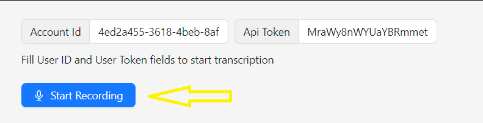

# Welcome to ivoice Integration Demo

Thank you for considering integrating with ivoice! We greatly appreciate your interest and support. This repository serves as a demonstration to guide you through the integration process.

## Getting Started

To get started with integrating your system with ivoice, follow these steps:

1. **Clone the Repository**:

```bash
git clone https://github.com/intellaworld/ivoice-integration-example.git
```

2. **Install Dependencies**:

```bash
cd ivoice-integration
npm install # or any other relevant command for your stack
```

3. **Configuration**:

- copy `.env.example` to `.env` and update the values with your own

```bash
cp .env.example .env
# set the value of `NEXT_PUBLIC_SOCKET_URI` to `wss://ws.intella-voice.com`
```

4. **Run the Demo**:

- Build the application
- Run the application

```bash
npm run build
npm run start
```

5. **Try the Demo**:

- Visit http://localhost:3000
- Set `Account Id` obtained from the developer portal
- Set `Api Token` obtained from your profile

  

- Click on `Start Recording` button and start speaking in Arabic
  

- Allow microphone access

- Enjoy transcription!

## Integration Guide

For a comprehensive integration guide, please refer to our official documentation [here](https://drive.google.com/file/d/1iYykE37SuQmmWGhDjVhNI-k25tKQ8BfF/view?usp=sharing).

### Explore the follwing files

To understand integration with ivoice

- ws handlers are implemented inside `src/pages/index.js`
- ws helper are impelemented inside `src/socket.js`

<!-- ## Issues and Support

If you encounter any issues during the integration process or have any questions, please don't hesitate to reach out to our support team at [support@example.com](mailto:support@example.com). -->

## Contributing

We welcome contributions from the community! If you have any suggestions for improvement, feel free to submit a pull request.

## License

GPL License
